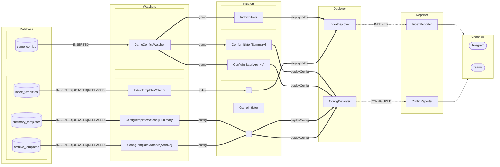

# db-game-configs-monitor-service

```mermaid
flowchart LR
    subgraph DB[Database]
        subgraph DB1[ ]
            IT[(index_templates)] & CT1[(summary_templates)] & CT2[(archive_templates)]
        end

        subgraph DB2[ ]
            GC[(game_configs)]
        end
    end

    subgraph W[Watchers]
        subgraph GW[ ]
            GC_W[GameConfigsWatcher]
        end

        subgraph TW[ ]
            IT_W[IndexTemplateWatcher] & CT1_W["ConfigTemplateWatcher[Summary]"] & CT2_W["ConfigTemplateWatcher[Archive]"]
        end
    end

    subgraph I[Initiators]

        subgraph GIG[ ]
            GI1( ) & GI[GameInitiator] & GI2( )
        end

        subgraph CIG[ ]
            C1_I["ConfigInitiator[Summary]"] & C2_I["ConfigInitiator[Archive]"]
        end

        subgraph IIG[ ]
            I_I[IndexInitator]
        end
    end

    subgraph D[Deployer]
        C_D[ConfigDeployer] & I_D[IndexDeployer]
    end

    subgraph R[Reporter]
        C_R[ConfigReporter] & I_R[IndexReporter]
    end

    subgraph Ch[Channels]
        direction TB
        Ch_Telegram([Telegram]) ~~~ Ch_Teams([Teams])
    end

    GC ==>|INSERTED| GC_W ===>|game| C1_I & C2_I & I_I
    C1_I & C2_I ==>|deployConfig| C_D
    I_I ==>|deployIndex| I_D

    IT ==>|"INSERTED|UPDATED|REPLACED|"| IT_W ==>|index| GI1 ===>|deployIndex| I_D
    CT1 ==>|"INSERTED|UPDATED|REPLACED|"| CT1_W ==>|config| GI2 ===>|deployConfig| C_D
    CT2 ==>|"INSERTED|UPDATED|REPLACED|"| CT2_W ==>|config| GI2 ===>|deployConfig| C_D

    I_D -..->|INDEXED| I_R ---> Ch
    C_D -..->|CONFIGURED| C_R ---> Ch
```
